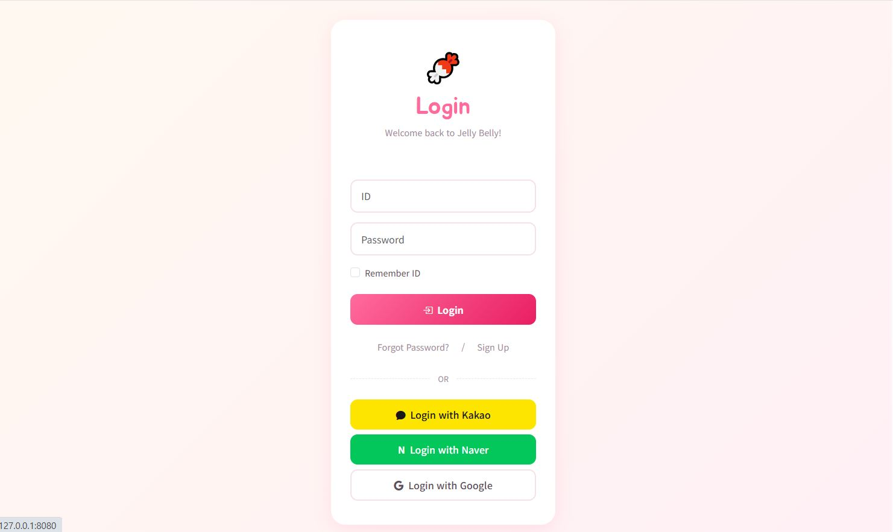
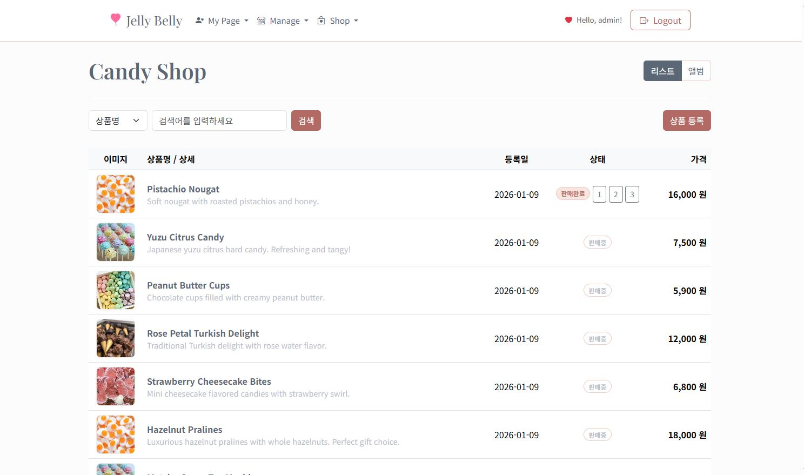
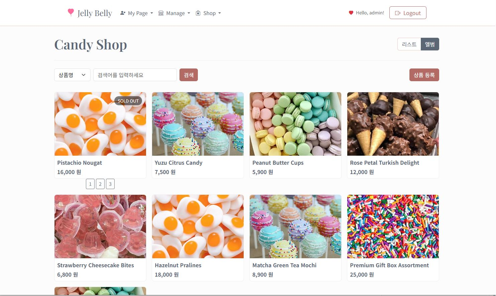
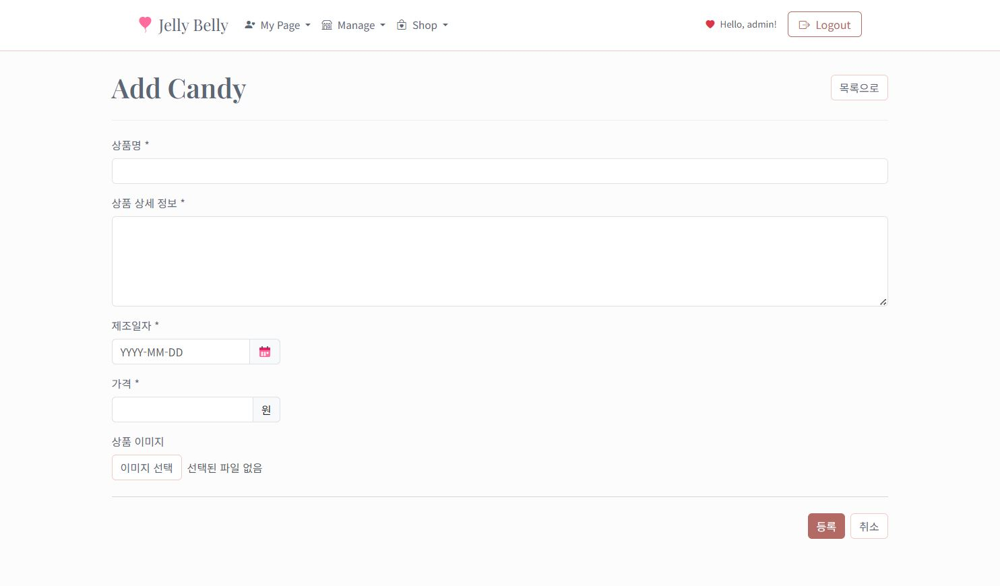
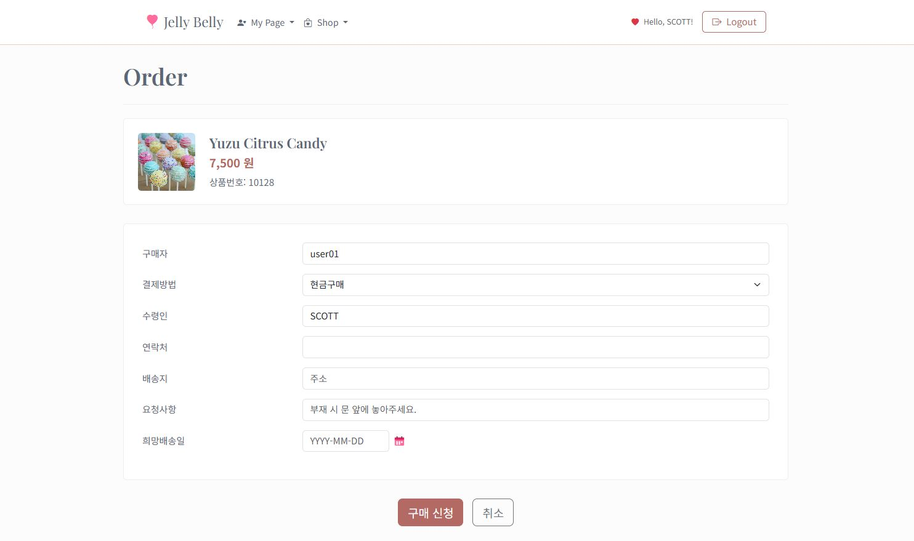
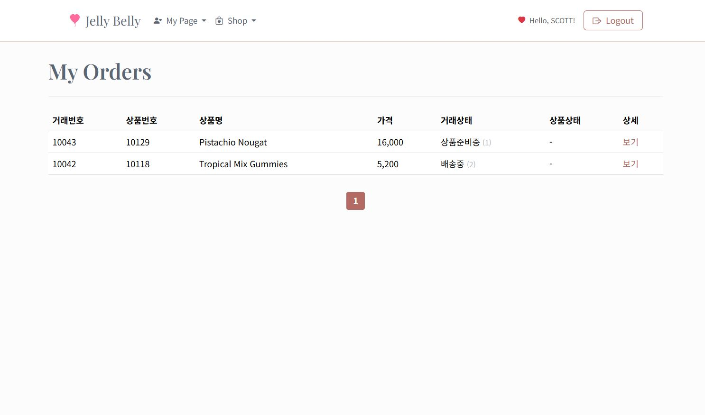
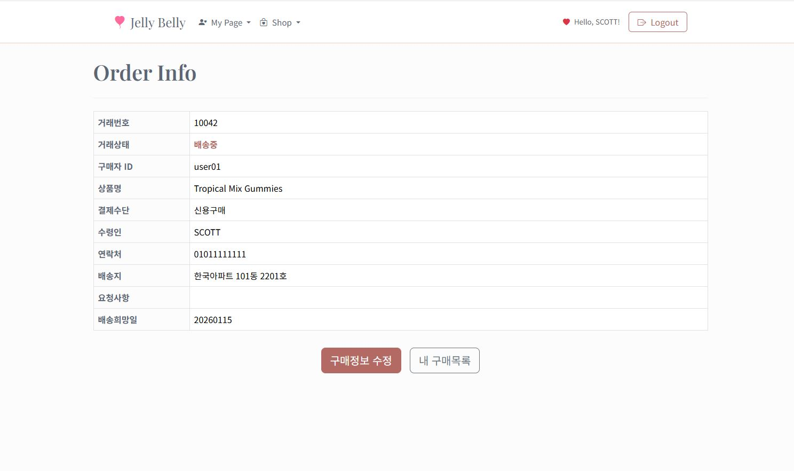
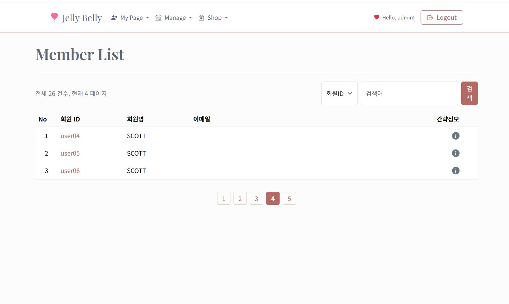
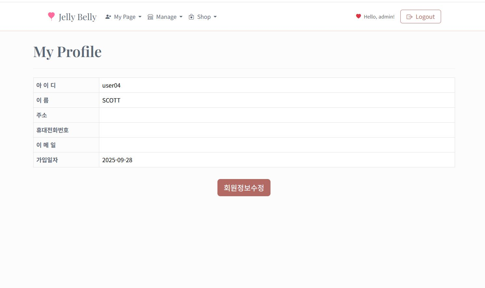

# Jelly Belly - Candy Shop

> Spring Boot 3.5 기반 온라인 캔디샵 쇼핑몰 개인 프로젝트


---

## 목차

1. [프로젝트 소개](#프로젝트-소개)
2. [기술 스택](#기술-스택)
3. [시스템 아키텍처](#시스템-아키텍처)
4. [ERD](#erd)
5. [프로젝트 구조](#프로젝트-구조)
6. [주요 기능](#주요-기능)
7. [API 명세](#api-명세)
8. [핵심 기술 구현](#핵심-기술-구현)
9. [화면 구성](#화면-구성)
10. [실행 방법](#실행-방법)
11. [개발 히스토리](#개발-히스토리)

---

## 프로젝트 소개

**Jelly Belly**는 달콤한 캔디샵 컨셉의 온라인 쇼핑몰입니다.

JSP/Servlet 기반 MVC 패턴을 01단계(기본 Servlet)부터 13단계(Spring Boot 전환)까지 점진적으로 학습하며 구현한 개인 프로젝트입니다. 최종적으로 Spring Boot 3.5.5 환경으로 마이그레이션하여 Controller-Service-DAO 3계층 구조와 MyBatis 연동을 적용했습니다.

### 주요 특징

- **3계층 아키텍처**: Controller - Service - DAO 분리
- **MyBatis 동적 쿼리**: 검색/페이징 SQL 동적 생성
- **소셜 로그인**: 카카오, 구글, 네이버 OAuth 2.0 연동
- **AOP 로깅**: Service 계층 메서드 호출 자동 로깅
- **Interceptor 인증**: 세션 기반 접근 제어
- **파일 업로드**: 상품 이미지 업로드/관리
- **REST API**: JSON 기반 비동기 통신 지원

---

## 기술 스택

### Backend

| 기술 | 버전 | 설명 |
|------|------|------|
| **Java** | 17 | LTS 버전 |
| **Spring Boot** | 3.5.5 | 웹 프레임워크 |
| **Spring AOP** | - | 횡단 관심사 분리 (로깅) |
| **MyBatis** | 3.0.5 | SQL Mapper |
| **Oracle DB** | 11g XE | 관계형 데이터베이스 |
| **Tomcat** | 10.x | WAS (내장) |

### Frontend

| 기술 | 버전 | 설명 |
|------|------|------|
| **JSP/JSTL** | Jakarta | 서버 사이드 렌더링 |
| **Bootstrap** | 5.3.2 | CSS 프레임워크 |
| **jQuery** | 3.x | JavaScript 라이브러리 |

### 외부 연동

| 서비스 | 용도 |
|--------|------|
| **Kakao OAuth** | 카카오 소셜 로그인 |
| **Google OAuth** | 구글 소셜 로그인 |
| **Naver OAuth** | 네이버 소셜 로그인 |

### 개발 도구

| 도구 | 용도 |
|------|------|
| Maven | 빌드 도구 |
| Git | 버전 관리 |
| IntelliJ IDEA / Eclipse STS | IDE |
| SQL Developer | DB 관리 |

---

## 시스템 아키텍처

```
┌─────────────────────────────────────────────────────────────────────┐
│                          Client (Browser)                            │
│                      JSP + Bootstrap + jQuery                        │
└─────────────────────────────────────────────────────────────────────┘
                                   │
                                   ▼
┌─────────────────────────────────────────────────────────────────────┐
│                      Spring Boot Application                         │
│  ┌────────────────────────────────────────────────────────────────┐ │
│  │                    LogonCheckInterceptor                        │ │
│  │                    (세션 기반 인증 체크)                         │ │
│  └────────────────────────────────────────────────────────────────┘ │
│                                   │                                  │
│  ┌────────────────────────────────────────────────────────────────┐ │
│  │                      Controller Layer                           │ │
│  │  UserController    ProductController    PurchaseController      │ │
│  │  UserRestController ProductRestController PurchaseRestController│ │
│  └────────────────────────────────────────────────────────────────┘ │
│                                   │                                  │
│  ┌────────────────────────────────────────────────────────────────┐ │
│  │                       Service Layer                             │ │
│  │     UserServiceImpl   ProductServiceImpl   PurchaseServiceImpl  │ │
│  │                    (@Transactional 적용)                        │ │
│  └────────────────────────────────────────────────────────────────┘ │
│                                   │                                  │
│  ┌────────────────────────────────────────────────────────────────┐ │
│  │                         DAO Layer                               │ │
│  │       UserDao         ProductDaoImpl       PurchaseDaoImpl      │ │
│  │     (@Mapper)       (SqlSession 기반)    (SqlSession 기반)      │ │
│  └────────────────────────────────────────────────────────────────┘ │
│                                   │                                  │
│  ┌────────────────────────────────────────────────────────────────┐ │
│  │                     LogAspectJ (AOP)                            │ │
│  │              Service 계층 메서드 호출 로깅                       │ │
│  └────────────────────────────────────────────────────────────────┘ │
└─────────────────────────────────────────────────────────────────────┘
                                   │
                                   ▼
┌─────────────────────────────────────────────────────────────────────┐
│                        MyBatis SQL Mapper                            │
│              UserMapper.xml / ProductMapper.xml / PurchaseMapper.xml │
└─────────────────────────────────────────────────────────────────────┘
                                   │
                                   ▼
┌─────────────────────────────────────────────────────────────────────┐
│                          Oracle Database                             │
│                    USERS / PRODUCT / TRANSACTION                     │
└─────────────────────────────────────────────────────────────────────┘
```

---

## ERD

```
┌──────────────────┐         ┌──────────────────┐         ┌──────────────────┐
│      USERS       │         │     PRODUCT      │         │   TRANSACTION    │
├──────────────────┤         ├──────────────────┤         ├──────────────────┤
│ USER_ID (PK)     │◄───┐    │ PROD_NO (PK)     │◄───┐    │ TRAN_NO (PK)     │
│ USER_NAME        │    │    │ PROD_NAME        │    │    │ PROD_NO (FK) ────┼───┘
│ PASSWORD         │    │    │ PROD_DETAIL      │    │    │ BUYER_ID (FK) ───┼───┐
│ ROLE             │    │    │ MANUFACTURE_DAY  │    │    │ PAYMENT_OPTION   │   │
│ SSN              │    │    │ PRICE            │    │    │ RECEIVER_NAME    │   │
│ CELL_PHONE       │    │    │ IMAGE_FILE       │    │    │ RECEIVER_PHONE   │   │
│ ADDR             │    │    │ REG_DATE         │    │    │ DEMAILADDR       │   │
│ EMAIL            │    │    │ PRO_TRAN_CODE    │    │    │ DLVY_REQUEST     │   │
│ REG_DATE         │    │    │ (판매중/판매완료) │    │    │ TRAN_STATUS_CODE │   │
└──────────────────┘    │    └──────────────────┘    │    │ ORDER_DATE       │   │
                        │                            │    │ DLVY_DATE        │   │
                        │                            │    └──────────────────┘   │
                        │                            │                           │
                        └────────────────────────────┼───────────────────────────┘
                                                     │
                                                     └─── 관계: 1 User → N Transaction
                                                          관계: 1 Product → N Transaction
```

### 테이블 설명

| 테이블 | 설명 | 주요 컬럼 |
|--------|------|-----------|
| **USERS** | 회원 정보 | user_id(PK), user_name, password, role |
| **PRODUCT** | 상품 정보 | prod_no(PK), prod_name, price, image_file, pro_tran_code |
| **TRANSACTION** | 구매(거래) 정보 | tran_no(PK), prod_no(FK), buyer_id(FK), tran_status_code |

---

## 프로젝트 구조

```
src/
├── main/
│   ├── java/com/model2/mvc/
│   │   │
│   │   ├── Application.java                    # Spring Boot 메인 (@EnableTransactionManagement)
│   │   ├── ServletInitializer.java             # WAR 배포용 초기화
│   │   │
│   │   ├── config/
│   │   │   └── WebConfig.java                  # Interceptor 등록
│   │   │
│   │   ├── common/
│   │   │   ├── Page.java                       # 페이지 네비게이션 계산
│   │   │   ├── Search.java                     # 검색 조건 캡슐화
│   │   │   ├── aspect/
│   │   │   │   └── LogAspectJ.java             # AOP 로깅 (@Around)
│   │   │   └── web/
│   │   │       ├── LogonCheckInterceptor.java  # 세션 인증 체크
│   │   │       └── GlobalExceptionHandler.java # 전역 예외 처리
│   │   │
│   │   ├── service/
│   │   │   ├── domain/                         # 엔티티 (POJO)
│   │   │   │   ├── User.java
│   │   │   │   ├── Product.java
│   │   │   │   └── Purchase.java
│   │   │   │
│   │   │   ├── user/                           # 회원 서비스
│   │   │   │   ├── UserService.java            # 인터페이스
│   │   │   │   ├── UserDao.java                # @Mapper 인터페이스
│   │   │   │   └── impl/
│   │   │   │       └── UserServiceImpl.java    # @Transactional
│   │   │   │
│   │   │   ├── product/                        # 상품 서비스
│   │   │   │   ├── ProductService.java
│   │   │   │   ├── ProductDao.java
│   │   │   │   └── impl/
│   │   │   │       ├── ProductServiceImpl.java
│   │   │   │       └── ProductDaoImpl.java     # SqlSession 기반
│   │   │   │
│   │   │   └── purchase/                       # 구매 서비스
│   │   │       ├── PurchaseService.java
│   │   │       ├── PurchaseDao.java
│   │   │       └── impl/
│   │   │           ├── PurchaseServiceImpl.java
│   │   │           └── PurchaseDaoImpl.java
│   │   │
│   │   └── web/                                # 컨트롤러
│   │       ├── MainController.java             # 메인 페이지
│   │       ├── user/
│   │       │   ├── UserController.java         # MVC 컨트롤러
│   │       │   └── UserRestController.java     # REST API
│   │       ├── product/
│   │       │   ├── ProductController.java
│   │       │   └── ProductRestController.java
│   │       └── purchase/
│   │           ├── PurchaseController.java
│   │           └── PurchaseRestController.java
│   │
│   ├── resources/
│   │   ├── application.properties              # Spring Boot 설정
│   │   ├── config/
│   │   │   └── common.properties               # pageSize, pageUnit
│   │   └── sql/
│   │       ├── mybatis-config.xml              # MyBatis 설정
│   │       ├── UserMapper.xml                  # 회원 SQL
│   │       ├── ProductMapper.xml               # 상품 SQL
│   │       └── PurchaseMapper.xml              # 구매 SQL
│   │
│   └── webapp/                                 # JSP 뷰
│       ├── index.jsp                           # 홈페이지
│       ├── main.jsp                            # 메인 (NEW/BEST)
│       ├── layout/
│       │   └── toolbar.jsp                     # 공통 헤더
│       ├── common/
│       │   ├── pageNavigator.jsp               # 페이지네이션
│       │   └── error.jsp                       # 에러 페이지
│       ├── user/                               # 회원 화면
│       ├── product/                            # 상품 화면
│       └── purchase/                           # 구매 화면
│
└── test/                                       # 테스트 코드
```

---

## 주요 기능

### 1. 회원 관리

| 기능 | 설명 |
|------|------|
| 회원가입 | 아이디 중복 확인, 유효성 검증 |
| 로그인/로그아웃 | 세션 기반 인증 |
| 소셜 로그인 | 카카오, 구글, 네이버 OAuth 2.0 |
| 회원정보 조회 | 본인 정보 확인 |
| 회원정보 수정 | 이름, 연락처, 주소, 이메일 |
| 회원 목록 | 관리자용 회원 조회 (검색/페이징) |

### 2. 상품 관리

| 기능 | 설명 |
|------|------|
| 상품 등록 | 이미지 파일 업로드 지원 |
| 상품 조회 | 상세 정보 확인 |
| 상품 수정 | 정보 및 이미지 변경 |
| 상품 목록 | 검색(상품명/가격) + 페이징 |
| 판매 상태 | 판매중/판매완료 전환 |
| 메인 페이지 | NEW 상품 4개 + BEST 상품 4개 |

### 3. 구매 관리

| 기능 | 설명 |
|------|------|
| 상품 구매 | 배송 정보 입력, 결제 옵션 선택 |
| 구매 상세 | 주문 정보 확인 |
| 구매 수정 | 배송 정보 변경 |
| 구매 목록 | 내 주문 내역 (페이징) |
| 배송 상태 | 주문→배송중→배송완료 변경 |

### 4. 검색 및 페이징

| 기능 | 설명 |
|------|------|
| 동적 검색 | MyBatis 동적 SQL로 조건별 검색 |
| Oracle 페이징 | ROWNUM 기반 3단계 서브쿼리 |
| 페이지 네비게이션 | pageUnit 단위 표시 (1-5, 6-10, ...) |

---

## API 명세

### 회원 API (Traditional MVC)

| Method | URL | 설명 |
|--------|-----|------|
| GET/POST | `/user/addUser` | 회원가입 |
| GET/POST | `/user/login` | 로그인 |
| GET | `/user/logout` | 로그아웃 |
| GET | `/user/getUser` | 회원정보 조회 |
| GET/POST | `/user/updateUser` | 회원정보 수정 |
| GET/POST | `/user/listUser` | 회원 목록 |
| POST | `/user/checkDuplication` | 아이디 중복 확인 |

### 소셜 로그인 API

| Method | URL | 설명 |
|--------|-----|------|
| GET | `/user/kakao/callback` | 카카오 콜백 |
| GET | `/user/google/callback` | 구글 콜백 |
| GET | `/user/naver/login` | 네이버 인가 요청 |
| GET | `/user/naver/callback` | 네이버 콜백 |

### 상품 API (Traditional MVC)

| Method | URL | 설명 |
|--------|-----|------|
| GET/POST | `/product/addProduct` | 상품 등록 |
| GET | `/product/getProduct` | 상품 상세 |
| GET/POST | `/product/updateProduct` | 상품 수정 |
| GET/POST | `/product/listProduct` | 상품 목록 |
| GET | `/product/main` | 메인 페이지 |

### 상품 REST API

| Method | URL | 설명 | 반환 |
|--------|-----|------|------|
| GET | `/product/json/getProduct/{prodNo}` | 상품 조회 | Product |
| GET | `/product/json/listProduct` | 상품 목록 | Map |
| POST | `/product/json/addProduct` | 상품 등록 | boolean |
| POST | `/product/json/updateTranCodeToSold` | 판매완료 처리 | boolean |
| POST | `/product/json/updateTranCodeToSale` | 판매중 복구 | boolean |
| GET | `/product/json/autocomplete` | 검색 자동완성 | Map |
| POST | `/product/file/upload` | 파일 업로드 | FileUploadResponse |

### 구매 API (Traditional MVC)

| Method | URL | 설명 |
|--------|-----|------|
| GET | `/purchase/addPurchaseView` | 구매 폼 |
| POST | `/purchase/addPurchase` | 구매 등록 |
| GET | `/purchase/getPurchase` | 구매 상세 |
| GET | `/purchase/listPurchase` | 구매 목록 |
| GET/POST | `/purchase/updatePurchase` | 구매 수정 |
| GET | `/purchase/updateTranCode` | 배송 상태 변경 |

### 구매 REST API

| Method | URL | 설명 | 반환 |
|--------|-----|------|------|
| POST | `/purchase/json/addPurchase` | 구매 등록 | Map |
| GET | `/purchase/json/getPurchase/{tranNo}` | 구매 조회 | Purchase |
| POST | `/purchase/json/getPurchaseList` | 구매 목록 | Map |
| POST | `/purchase/json/updatePurchase` | 구매 수정 | Map |
| POST | `/purchase/json/updateTranCode` | 배송 상태 변경 | Map |

---

## 핵심 기술 구현

### 1. OAuth 2.0 소셜 로그인

```java
// 카카오 로그인 콜백 처리
@GetMapping("/kakao/callback")
public String kakaoCallback(@RequestParam String code, HttpSession session) {
    // 1. 인가 코드로 Access Token 교환
    String accessToken = getKakaoAccessToken(code);

    // 2. Access Token으로 사용자 정보 조회
    Map<String, Object> userInfo = getKakaoUserInfo(accessToken);
    String kakaoId = "k-" + userInfo.get("id");

    // 3. DB 조회 및 자동 회원가입
    User user = userService.getUser(kakaoId);
    if (user == null) {
        user = new User();
        user.setUserId(kakaoId);
        user.setPassword("snslogin");
        userService.addUser(user);
    }

    // 4. 세션에 로그인 정보 저장
    session.setAttribute("user", user);
    return "redirect:/product/main";
}
```

### 2. AOP 기반 로깅

```java
@Aspect
@Component
public class LogAspectJ {

    @Around("execution(* com.model2.mvc.service..*Impl.*(..))")
    public Object invoke(ProceedingJoinPoint joinPoint) throws Throwable {
        // 메서드 호출 전 로깅
        System.out.println("[AOP Before] " +
            joinPoint.getTarget().getClass().getName() + "." +
            joinPoint.getSignature().getName());

        // 인자 로깅
        if (joinPoint.getArgs().length > 0) {
            System.out.println("[AOP Args] " + joinPoint.getArgs()[0]);
        }

        // 메서드 실행
        Object result = joinPoint.proceed();

        // 메서드 호출 후 로깅
        System.out.println("[AOP After] Return: " + result);
        return result;
    }
}
```

### 3. Interceptor 인증 처리

```java
public class LogonCheckInterceptor implements HandlerInterceptor {

    @Override
    public boolean preHandle(HttpServletRequest request,
                            HttpServletResponse response,
                            Object handler) throws Exception {

        HttpSession session = request.getSession();
        User user = (User) session.getAttribute("user");
        String uri = request.getRequestURI();

        // 허용 URI (로그인 없이 접근 가능)
        List<String> allowedUris = Arrays.asList(
            "addUser", "login", "checkDuplication",
            "kakao", "google", "naver"
        );

        boolean isAllowed = allowedUris.stream()
            .anyMatch(uri::contains);

        // 미로그인 + 보호 자원 → 접근 차단
        if (user == null && !isAllowed) {
            request.getRequestDispatcher("/index.jsp").forward(request, response);
            return false;
        }

        // 로그인 상태 + 로그인/회원가입 재요청 → 차단
        if (user != null && isAllowed) {
            request.getRequestDispatcher("/index.jsp").forward(request, response);
            return false;
        }

        return true;
    }
}
```

### 4. MyBatis 동적 쿼리 (페이징 + 검색)

```xml
<!-- ProductMapper.xml -->
<select id="getProductList" parameterType="search" resultMap="productSelectMap">
    SELECT *
    FROM (
        SELECT inner_table.*, ROWNUM AS row_seq
        FROM (
            SELECT p.prod_no, p.prod_name, p.price, p.image_file, p.reg_date,
                   DECODE(p.pro_tran_code, NULL, '판매중', p.pro_tran_code) AS pro_tran_code
            FROM product p

            <!-- 동적 검색 조건 -->
            <if test="searchCondition != null">
                <where>
                    <if test="searchCondition == 0 and searchKeyword != ''">
                        p.prod_name LIKE '%' || #{searchKeyword} || '%'
                    </if>
                    <if test="searchCondition == 1 and searchKeyword != ''">
                        TO_CHAR(p.price) = #{searchKeyword}
                    </if>
                </where>
            </if>

            ORDER BY p.reg_date DESC, p.prod_no DESC
        ) inner_table
        WHERE ROWNUM &lt;= #{endRowNum}
    )
    WHERE row_seq BETWEEN #{startRowNum} AND #{endRowNum}
</select>
```

### 5. 트랜잭션 관리

```java
@Service("productServiceImpl")
public class ProductServiceImpl implements ProductService {

    @Autowired
    private ProductDao productDao;

    @Override
    @Transactional  // 쓰기 작업
    public void addProduct(Product product) {
        productDao.addProduct(product);
    }

    @Override
    @Transactional(readOnly = true)  // 읽기 전용
    public Product getProduct(int prodNo) {
        return productDao.getProduct(prodNo);
    }

    @Override
    @Transactional
    public void updateProTranCodeToSold(int prodNo) {
        productDao.updateProTranCodeToSold(prodNo);
    }
}
```

### 6. 구매 프로세스 (핵심 비즈니스 로직)

```java
// PurchaseController.java
@PostMapping("addPurchase")
public String addPurchase(@RequestParam int prodNo,
                         @RequestParam String paymentOption,
                         @RequestParam String receiverName,
                         @RequestParam String receiverPhone,
                         @RequestParam String dlvyAddr,
                         HttpSession session) throws Exception {

    User user = (User) session.getAttribute("user");

    // 1. Purchase 객체 구성
    Purchase purchase = new Purchase();
    purchase.setBuyer(user);
    purchase.setPurchaseProd(new Product());
    purchase.getPurchaseProd().setProdNo(prodNo);
    purchase.setPaymentOption(paymentOption);
    purchase.setReceiverName(receiverName);
    purchase.setReceiverPhone(receiverPhone);
    purchase.setDlvyAddr(dlvyAddr);
    purchase.setTranCode("1");  // 배송상태: 주문

    // 2. 구매 등록 (tranNo 자동 생성)
    purchaseService.addPurchase(purchase);

    // 3. 상품 상태 '판매완료'로 변경
    productService.updateProTranCodeToSold(prodNo);

    return "redirect:/purchase/getPurchase?tranNo=" + purchase.getTranNo();
}
```

---

## 화면 구성

| 페이지 | 파일 | 설명 |
|--------|------|------|
| **홈** | index.jsp | 시작 페이지 |
| **메인** | main.jsp | NEW/BEST 상품 표시 |
| **로그인** | user/loginView.jsp | 일반/소셜 로그인 |
| **회원가입** | user/addUserView.jsp | 회원 정보 입력 |
| **회원정보** | user/getUser.jsp | 회원 정보 조회 |
| **상품 목록** | product/listProduct.jsp | 검색/페이징 |
| **상품 상세** | product/getProduct.jsp | 상품 정보 + 구매 버튼 |
| **상품 등록** | product/addProductView.jsp | 관리자용 |
| **구매 폼** | purchase/addPurchaseView.jsp | 배송 정보 입력 |
| **구매 상세** | purchase/getPurchase.jsp | 주문 정보 확인 |
| **구매 목록** | purchase/listPurchase.jsp | 내 주문 내역 |

### 스크린샷

| 메인 페이지 | 로그인 |
|:-----------:|:------:|
|  |  |

| 상품 목록 | 상품 목록 (그리드) |
|:---------:|:-----------------:|
|  |  |

| 회원가입 | 마이페이지 |
|:--------:|:----------:|
|  |  |

| 상품 등록 | 구매하기 |
|:---------:|:--------:|
|  |  |

| 구매 목록 | 구매 상세 |
|:---------:|:---------:|
|  |  |

| 회원 목록 (관리자) | 회원 상세 |
|:------------------:|:---------:|
|  |  |

---

## 실행 방법

### 1. 사전 요구사항

- JDK 17 이상
- Oracle Database 11g XE
- Maven 3.x

### 2. 데이터베이스 설정

```sql
-- Oracle 접속 정보
URL: jdbc:oracle:thin:@127.0.0.1:1521:xe
Username: scott
Password: tiger

-- 테이블 생성 (예시)
CREATE TABLE users (
    user_id VARCHAR2(20) PRIMARY KEY,
    user_name VARCHAR2(50),
    password VARCHAR2(50),
    role VARCHAR2(10) DEFAULT 'user',
    ssn VARCHAR2(13),
    cell_phone VARCHAR2(20),
    addr VARCHAR2(100),
    email VARCHAR2(50),
    reg_date DATE DEFAULT SYSDATE
);

CREATE TABLE product (
    prod_no NUMBER PRIMARY KEY,
    prod_name VARCHAR2(100),
    prod_detail CLOB,
    manufacture_day VARCHAR2(8),
    price NUMBER,
    image_file VARCHAR2(100),
    pro_tran_code VARCHAR2(10),
    reg_date DATE DEFAULT SYSDATE
);

CREATE SEQUENCE seq_product_prod_no START WITH 10001;

CREATE TABLE transaction (
    tran_no NUMBER PRIMARY KEY,
    prod_no NUMBER REFERENCES product(prod_no),
    buyer_id VARCHAR2(20) REFERENCES users(user_id),
    payment_option VARCHAR2(20),
    receiver_name VARCHAR2(50),
    receiver_phone VARCHAR2(20),
    demailaddr VARCHAR2(200),
    dlvy_request VARCHAR2(200),
    tran_status_code VARCHAR2(2),
    order_date DATE DEFAULT SYSDATE,
    dlvy_date VARCHAR2(8)
);

CREATE SEQUENCE seq_transaction_tran_no START WITH 1;
```

### 3. 소셜 로그인 API 키 설정 (선택사항)

소셜 로그인 기능을 사용하려면 각 플랫폼에서 API 키를 발급받아 설정해야 합니다.

#### 키 발급 링크

| 플랫폼 | 개발자 콘솔 |
|--------|-------------|
| **카카오** | https://developers.kakao.com |
| **구글** | https://console.cloud.google.com |
| **네이버** | https://developers.naver.com |

#### 설정 파일 위치

**1) UserController.java** (`src/main/java/com/model2/mvc/web/user/UserController.java`)

```java
// 카카오 (277번줄)
params.add("client_id", "YOUR_KAKAO_CLIENT_ID");

// 구글 (387-388번줄)
params.add("client_id", "YOUR_GOOGLE_CLIENT_ID");
params.add("client_secret", "YOUR_GOOGLE_CLIENT_SECRET");

// 네이버 (506-507번줄)
String clientId = "YOUR_NAVER_CLIENT_ID";
String clientSecret = "YOUR_NAVER_CLIENT_SECRET";
```

**2) loginView.jsp** (`src/main/webapp/user/loginView.jsp`)

```javascript
// 카카오 (330번줄)
'?client_id=' + encodeURIComponent('YOUR_KAKAO_CLIENT_ID')

// 구글 (338번줄)
'?client_id=' + encodeURIComponent('YOUR_GOOGLE_CLIENT_ID')
```

> **Note**: API 키가 설정되지 않으면 소셜 로그인 기능은 동작하지 않습니다. 일반 로그인은 정상 동작합니다.

### 4. 애플리케이션 실행

```bash
# Maven으로 실행
mvn spring-boot:run

# 또는 JAR 빌드 후 실행
mvn clean package
java -jar target/12Model2MVCShop_SpringBoot3.5-0.0.1-SNAPSHOT.war
```

### 5. 접속

```
http://localhost:8080
```

---

## 개발 히스토리

### Spring Boot 3.x 마이그레이션

| 항목 | Before (2.x) | After (3.x) |
|------|--------------|-------------|
| Servlet API | `javax.servlet.*` | `jakarta.servlet.*` |
| JSTL | `javax.servlet.jsp.jstl` | `jakarta.servlet.jsp.jstl` |
| Tomcat | 9.x | 10.x |
| Java | 8+ | 17+ (필수) |

### 해결한 주요 이슈

| 이슈 | 원인 | 해결 |
|------|------|------|
| 상품 등록 후 조회 불가 | @Transactional 누락 | ServiceImpl에 @Transactional 추가 |
| MyBatis Mapper 인식 실패 | namespace 불일치 | DAO 인터페이스 FQCN으로 수정 |
| JSP 렌더링 안됨 | tomcat-embed-jasper 누락 | pom.xml에 의존성 추가 |
| JSTL 태그 오류 | Jakarta 네임스페이스 | jakarta.servlet.jsp.jstl 의존성 추가 |

---

## 프로젝트 정보

- **개발 기간**: 2025.08 ~ 2025.10
- **인원**: 1명 (개인 프로젝트)
- **목적**: JSP/Servlet MVC → Spring Boot 마이그레이션 학습

---

## 라이선스

This project is for educational purposes.
